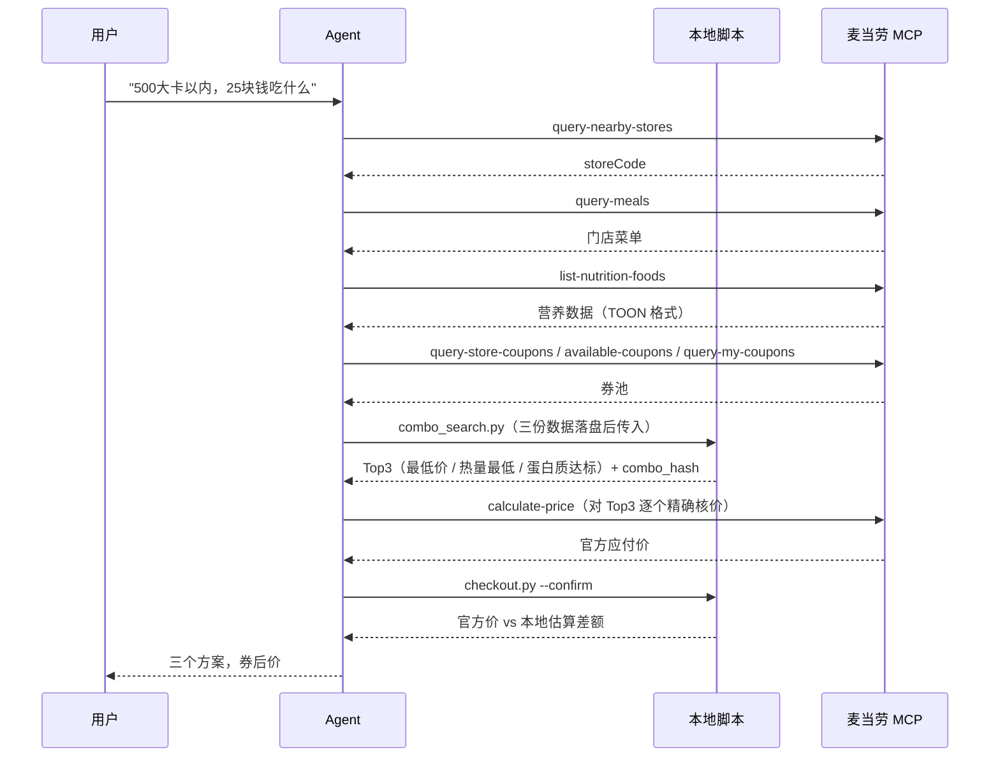
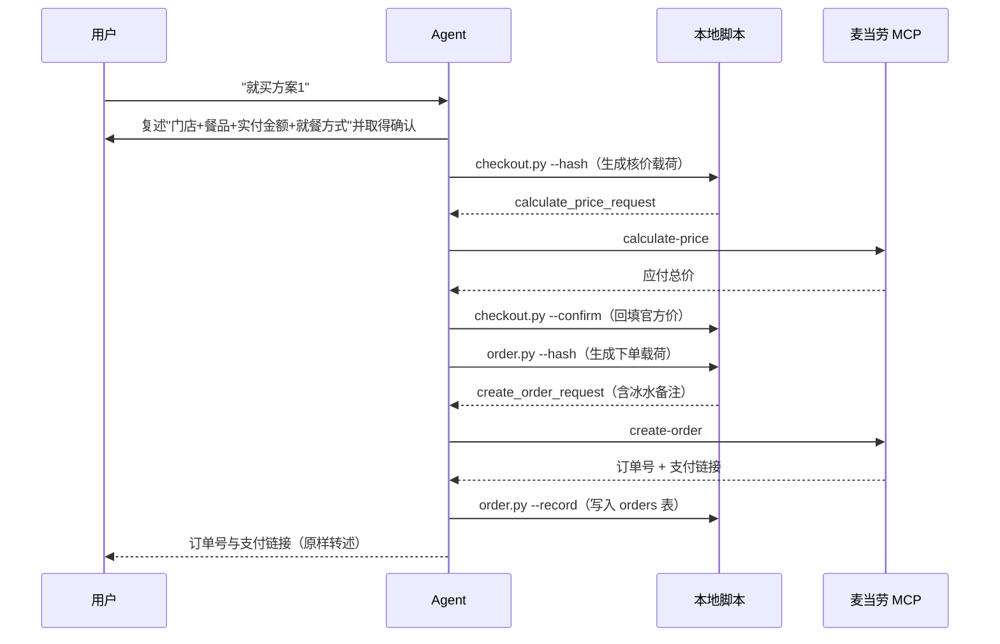

# 麦当劳 MCP 集成说明

本项目**真实使用**麦当劳中国 MCP Server 提供的能力，覆盖"取数 → 推荐 → 核价 → 下单"全链路。

## 1. MCP Server 接入

| 项 | 值 |
|---|---|
| Server 名称 | `mcd-mcp`（麦当劳中国官方托管） |
| 接入地址 | `https://mcp.mcd.cn` |
| 传输协议 | Streamable HTTP |
| 鉴权方式 | 请求头 `Authorization: Bearer <MCD_MCP_TOKEN>` |
| Token 申请 | <https://open.mcd.cn/mcp>（手机号登录后申请） |
| 限流 | 600 请求 / 分钟（超出返回 429） |
| Client | 腾讯 WorkBuddy（连接器 → 自定义连接器 → 配置 MCP） |

脱敏配置见仓库根目录 [`mcp-config.example.json`](./mcp-config.example.json)，
**只使用环境变量占位符 `${MCD_MCP_TOKEN}`，不含任何真实凭证**。

WorkBuddy 中的配置路径：左侧边栏【专家·技能·连接器】→【连接器】→ 右上角【自定义连接器】→【配置 MCP】。

## 2. 使用的 Tool 清单

| Tool | 用途 | 项目中的调用位置 |
|---|---|---|
| `list-nutrition-foods` | 获取全量餐品营养数据（能量/蛋白质/脂肪/碳水/钠/钙） | 组合搜索的约束数据源，落盘为 `data/mcp_cache/nutrition.toon.txt`，由 `combo_search.py` 解析 |
| `query-nearby-stores` | 查询用户地址附近门店，取得 `storeCode` | 组合搜索与下单的前置，`storeCode` 不可猜测 |
| `query-meals` | 查询当前门店可售餐品与分类、编码 | 组合搜索的候选池来源，落盘为 `data/mcp_cache/menu.json` |
| `query-store-coupons` | 查询当前门店可用券 | 券池来源之一，参与券后价排序 |
| `available-coupons` | 麦麦省当前**可领取**的券 | 券池来源之二，与门店券合并去重 |
| `query-my-coupons` | 用户已持有的券 | 券池来源之三，与上者合并去重 |
| `auto-bind-coupons` | 一键领取麦麦省可用券 | 用户明确说"帮我领券"时调用，之后重新取券池 |
| `calculate-price` | 按商品列表 + 券计算应付总价 | 核价闭环，`checkout.py --confirm` 回填官方价 |
| `create-order` | 创建订单，返回订单号与支付链接 | 下单闭环，`order.py --record` 回填 |
| `query-order` | 查询订单状态 | `order.py --sync` 同步本地订单状态 |
| `delivery-query-addresses` | 查询用户配送地址 | 外送场景取 `addressId` 传入下单请求 |
| `order-list` | 查询历史订单 | 复购场景（规划中，当前未接入脚本） |

合计 **11 个 Tool 已接入脚本**，1 个规划中。

## 3. 调用流程

### 3.1 架构约定：脚本准备参数，Agent 执行调用

本项目的脚本**不直接发起 MCP 请求**，而是把职责切成两半：

- **脚本侧**：解析 MCP 返回、生成规范化的**请求载荷**、应用返回结果、落库
- **Agent 侧**：拿着载荷调用 MCP Tool，把返回原样落盘

这样做的原因：MCP 调用发生在具备用户登录态的 Agent 一侧，而组合计算、券后价排序、
社区读写这些重逻辑放在本地 Python 里，可测试、可复现、可回归。接口字段一旦变化，
只需改脚本的字段探测层，不必重写流程。

### 3.2 场景 A：系统推荐区（组合搜索）



### 3.3 场景 B：用户搭配区（社区）

社区读写全部在本地 SQLite 完成，不消耗 MCP 调用配额。
`combo_hash` 由餐品编码字典序排序后取 SHA256 前 16 位生成，
保证**同一组餐品无论从推荐区还是搭配区进入，哈希一致、评论互通**。

### 3.4 场景 C：下单闭环



## 4. 业务价值

| 维度 | 说明 |
|---|---|
| **券使用率** | 把 `query-store-coupons` / `available-coupons` / `query-my-coupons` 三源券池纳入组合排序，用户不需要逐条比对券后价。券从"用户想起来才用"变成"默认就用最优的那张"。 |
| **决策成本** | 用户只需给热量与预算两个数字，帕累托搜索输出三套不同取向的方案，替代"翻菜单半小时"。 |
| **客单结构** | 组合推荐天然带出饮品/配餐；内置的免费冰水让方案更完整而不增加用户支出。 |
| **价格可信** | 本地估算只用于筛选，最终价以 `calculate-price` 为准，避免"看着便宜下单变贵"。 |
| **复访动机** | 社区搭配区提供"别人怎么搭"的参考，顶/踩/评论形成正反馈；热榜随时间衰减，新方案有机会曝光。 |
| **全链路闭环** | 从推荐直接走到 `create-order`，用户在同一段对话里完成选品、用券、下单。 |

## 5. 关键工程处理

**TOON 格式解析**：`list-nutrition-foods` 为降低 Token 消耗，返回的是 TOON（Token-Oriented
Object Notation）紧凑格式而非标准 JSON 数组，形如：

```
{productName,nutritionDescription,energyKj,energyKcal,protein,fat,carbohydrate,sodium,calcium}:
 猪柳麦满分,null,1288,308,16,16,24,781,213
```

`combo_search.py` 内置了 TOON 解析器（含带引号字段的 CSV 切分），同时兼容标准 JSON 返回。

**字段名容错**：MCP 不同 Tool 的返回结构存在差异，`store.py` 提供 `pick()` 按候选键名
依次探测（如 `payAmount` / `actualAmount` / `payTotal` 等），`to_num()` 宽松解析
带货币符号的金额字符串。字段探测层与业务逻辑分离，接口调整时改动面最小。

**虚拟商品剥离**：项目内置 0 元 0 卡路里的"免费冰水"选项，它**不是真实 SKU**，
无法出现在订单商品列表中。`store.split_virtual()` 在下单前自动将其剥离，
改写进订单备注（`remark`），保证真实订单合法。

**限流控制**：MCP 限流 600 请求/分钟。组合枚举完全在本地进行，只对最终 Top3 调用
`calculate-price`，避免为每个候选组合打接口。

**约束严格性**：热量/价格/蛋白质过滤采用严格模式——缺少对应数据的组合**不算满足约束**，
防止未知热量的组合被推荐给减脂用户。

## 6. 验证状态

为保证说明的真实性，如实标注各项的验证程度：

| 项目 | 状态 |
|---|---|
| MCP 连接器配置 | ✅ 已配置（`mcp-config.example.json`） |
| 11 个 Tool 的调用载荷生成与返回解析 | ✅ 已实现，含字段容错 |
| 全链路端到端回归测试 | ✅ `scripts/selftest.py` 52 项断言全绿（在 mock 返回数据上） |
| 真实 Token 联调 | ⏳ 待完成（脚本字段探测层已预留多候选键名，需按真实返回校准） |

仓库提供的 `data/demo/` 内为构造的示例数据，用于让自测与可视化验证页可离线复现，
**不代表麦当劳真实菜单与价格**。

## 7. 声明

本项目为麦当劳程序员节创意开发大赛参赛作品，由参赛者独立开发，非麦当劳官方产品。
项目输出仅供参考，不构成医疗、营养或其他专业建议；餐品信息、价格及供应状态以麦当劳
官方渠道的实时结果为准。

使用麦当劳 MCP 服务须遵守麦当劳中国的《使用条款》及《麦当劳 MCP 服务规则》。
