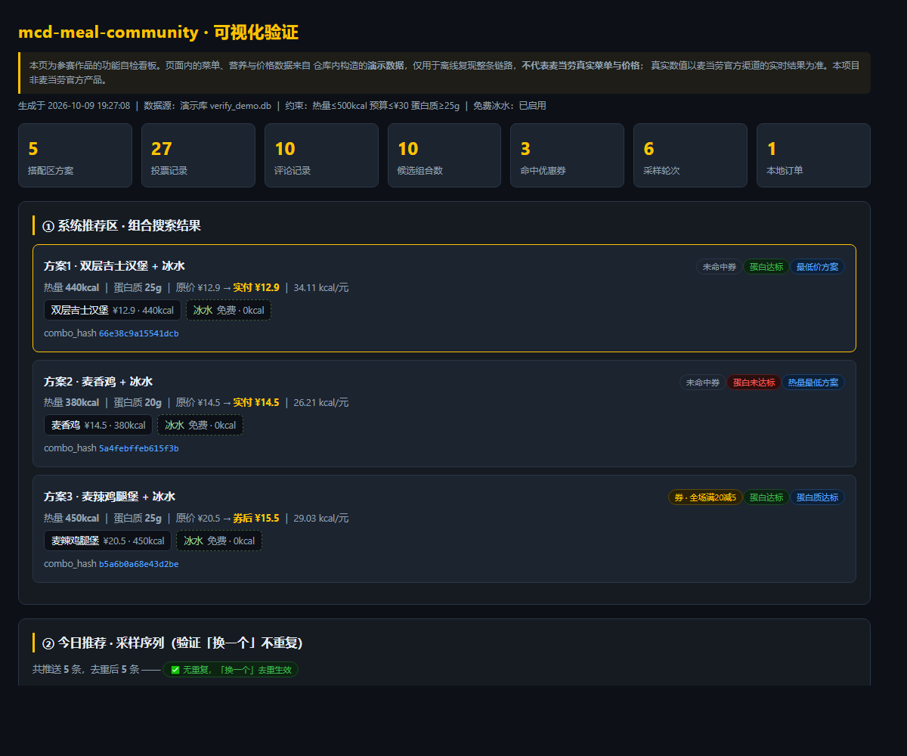
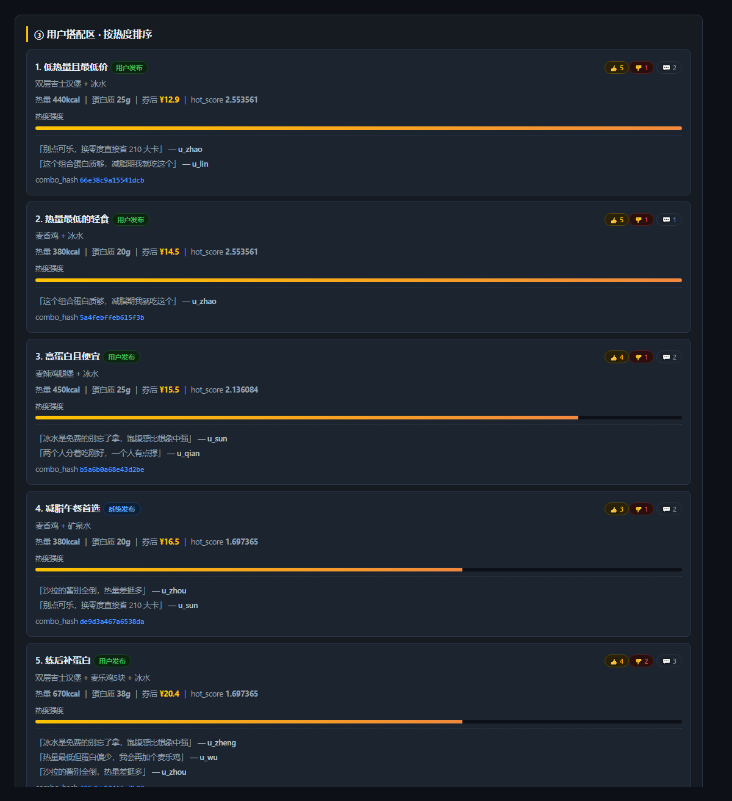
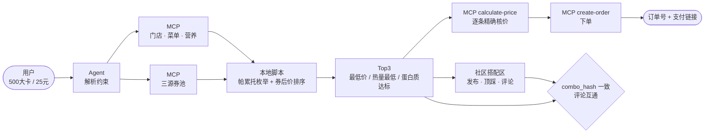

# 麦麦营养搭子 · 一句话算好这餐，一整个社区帮你参考

> 说一句「500 大卡以内，25 块钱吃什么」，就拿到三套算好热量、算完券的组合——**能一键下单，也能晒出去让别人顶**。

基于**麦当劳中国官方 MCP Server** 开发的 WorkBuddy Skill。「搭」既是**搭配**（把餐品算成一套），也是**搭子**（一起吃、互相参考的人）。

> 🖥️ **在线预览**：开启 GitHub Pages 后访问 <https://archerko-code.github.io/mcd-meal-community/>
> （设置路径：仓库 Settings → Pages → Source 选 `Deploy from a branch` → Branch 选 `main` / 目录选 `/docs`）
>
> 不想开 Pages 也可以直接打开仓库内的 [`docs/index.html`](./docs/index.html)，或本地下载后双击查看。

[](https://open.mcd.cn/mcp)
[](#麦当劳-mcp-工具清单)
[](#可视化验证与自测)
[](./LICENSE)



<sub>截图来自仓库内置的可视化验证看板（演示数据）。完整看板见 [`docs/index.html`](./docs/index.html)，全页长图见 [`assets/demo.png`](./assets/demo.png)。</sub>

---

## 目录

- [为什么叫「搭子」](#为什么叫搭子)
- [它解决什么问题](#它解决什么问题)
- [核心能力](#核心能力)
- [一分钟看懂工作流](#一分钟看懂工作流)
- [安装方法](#安装方法)
- [使用示例](#使用示例)
- [目标用户](#目标用户)
- [麦当劳 MCP 工具清单](#麦当劳-mcp-工具清单)
- [项目结构](#项目结构)
- [可视化验证与自测](#可视化验证与自测)
- [设计取舍](#设计取舍)
- [常见问题](#常见问题)
- [免责声明](#免责声明)

---

## 为什么叫「搭子」

因为**这个工具是两条腿走路的，缺一条都不成立**。

大多数选餐工具到「推荐给你」就结束了。麦麦营养搭子后面还接着一整条社交链——你可以把方案晒出去，别人顶你、踩你、在下面留言；也可以反过来先逛逛别人怎么搭的。

| | **系统推荐区** | **用户搭配区** |
|---|---|---|
| **你做什么** | 说个热量和预算，拿三套方案 | 逛别人发的组合，顶 / 踩 / 评论 |
| **谁在算** | 帕累托枚举 + 三源券池比价 | 时间衰减热榜排序 |
| **怎么联动** | 算出的组合可一键发布 | 同一个 `combo_hash`，**评论自动继承** |

两区之间那座桥叫 `combo_hash`：`sorted(商品编码) → "|" 拼接 → SHA256 前 16 位`。同一组餐品，不管你从推荐区算出来、还是手动搭配发布出去，**哈希完全相同，评论是同一条**。



<sub>用户搭配区实拍：热榜排序、顶踩数、评论、热度强度条、`combo_hash`。图里的「用户发布 / 系统发布」标记区分方案来源。</sub>

> 这条桥为什么重要：推荐区给的是「机器算的答案」，搭配区给的是「别人的答案」。两者共用同一套编号，才让「我算的方案跟榜上那条一模一样」变成一个可以讨论的公共对象，而不是两套各说各话的数据。

「搭」这一个字，正好双关：**搭配**是算法在做的事，**搭子**是社区里发生的事。

---

## 它解决什么问题

身材管理期走进麦当劳，现实是这样的：

1. **不知道吃什么**——菜单上不标热量，官网营养表是 PDF，还得自己对号入座；
2. **不知道多少钱**——有券但不知道哪张最划算，满减和折扣哪个更省要心算；
3. **凑不出组合**——想「一主食 + 一配餐 + 一饮品」凑到卡路里和预算都合适，属于手动穷举；
4. **不知道别人怎么吃的**——每天中午永远在那几个固定选项里打转，朋友有隐藏吃法也不会专门发给你；
5. **下单还得重来**——选好了才发现券用错、价格和想象的不一样。

本工具把上面五步合成一次对话：**给出热量上限 + 预算上限，返回三套已核价的组合**；不满意就看看社区里别人怎么搭的。

---

## 核心能力

### 系统推荐区 · 把选择压缩成两个数字

| 能力 | 说明 |
|---|---|
| 🎯 **三约束组合搜索** | 热量 × 预算（可选蛋白质下限）下的**帕累托最优**枚举，一次给出三套不同取向的方案 |
| 💰 **券后价优先** | 同时合并「门店券 / 麦麦省可领券 / 用户已持有券」三个来源去重排序，自动挑净减最多的一张 |
| 🥤 **免费冰水补全** | 不含饮品的组合自动补一杯 0 元 0 卡的冰水，让方案成为完整一餐，且不增加支出 |
| 🧮 **官方核价闭环** | 本地估算只用于初筛，最终价以 `calculate-price` 为准，杜绝「看着便宜、下单变贵」 |
| 🛒 **一键下单** | 从推荐直接走到 `create-order`，返回订单号与支付链接 |
| 🛡️ **分层降级** | 约束过紧时先放宽 10% 热量并明确告知，而不是直接报「无结果」 |

### 用户搭配区 · 让搭配变成公共话题

| 能力 | 说明 |
|---|---|
| 👥 **发布 / 顶 / 踩 / 评论** | 用户可发布自己的组合；顶踩是**改票**不是叠加，重复投票只更新不刷分 |
| 🧩 **`combo_hash` 跨区打通** | 推荐区算出的组合与搭配区发布的组合，同一组餐品即同一个哈希，**评论自动继承** |
| 🔥 **时间衰减热榜** | `hot_score = (净票+1)^0.8 / (小时+2)^0.5`，新方案有机会冒头，老方案不会永久霸榜 |
| 🔍 **按约束逛社区** | 可以带热量/预算/蛋白质条件筛社区方案——「400 kcal 以内别人都怎么搭」是一个查询 |
| 🔁 **不重复推荐** | 「换一个」按会话去重；社区池推完会如实告知，不做无意义重试 |
| 📊 **可视化自检** | 一条命令生成单文件 HTML 看板，六块区域验证整条链路是否成立 |

---

## 一分钟看懂工作流



**架构约定：脚本准备参数，Agent 执行调用。** 脚本不直接发 MCP 请求，而是生成规范化请求载荷；Agent 拿着载荷调用 MCP，把返回原样落盘。好处是重逻辑（组合枚举、券后价、社区读写）全在本地 Python 里，可测试、可复现；MCP 字段一旦变化，只改字段探测层即可。

---

## 安装方法

### 前置条件

- 一个麦当劳中国 MCP Token → 到 <https://open.mcd.cn/mcp> 用手机号登录后，在「控制台」点击**激活**申请
- Python 3.9+（仅用标准库，**零第三方依赖**）
- 腾讯 WorkBuddy（推荐；本 Skill 的对话编排依赖它）

### 1. 在 WorkBuddy 中配置 MCP 连接器

左侧边栏【专家·技能·连接器】→【连接器】页签 → 右上角【自定义连接器】→【配置 MCP】，填入：

```json
{
  "mcpServers": {
    "mcd-mcp": {
      "type": "streamablehttp",
      "url": "https://mcp.mcd.cn",
      "headers": {
        "Authorization": "Bearer YOUR_MCP_TOKEN"
      }
    }
  }
}
```

> ⚠️ **务必把 `YOUR_MCP_TOKEN` 换成你自己的 Token**，保存后回到【自定义连接器】把 `mcd-mcp` 设为**启用**。
>
> 脱敏版本见仓库根目录 [`mcp-config.example.json`](./mcp-config.example.json)（只含 `${MCD_MCP_TOKEN}` 环境变量占位符，**不含任何真实凭证**）。

### 2. 安装本 Skill

把本仓库放到 WorkBuddy 的技能目录：

```bash
git clone <本仓库地址> ~/.workbuddy/skills/mcd-meal-community
```

Windows 对应路径为 `C:\Users\<你>\.workbuddy\skills\mcd-meal-community`。

### 3. 初始化数据库

```bash
cd ~/.workbuddy/skills/mcd-meal-community/scripts
python3 store.py      # 建表 + 迁移，无输出即成功
```

### 4. 验证安装

```bash
python3 selftest.py   # 退出码 0 = 全部通过
```

看到 `✅ 全部通过` 就装好了。

---

## 使用示例

### 示例 1 · 系统推荐区：找一套吃的

> **你**：帮我搭配 500 大卡以内、25 块以内的，蛋白质最好有 25 克

Agent 会调用 MCP 拉取门店菜单、营养数据与三源券池，本地枚举后输出：

| # | 方案 | 组合 | 热量 | 蛋白 | 券后价 |
|---|---|---|---|---|---|
| 1 | 最低价方案 | 双层吉士汉堡 + 冰水 | 440 kcal | 25 g | **¥12.9** |
| 2 | 热量最低方案 | 麦香鸡 + 冰水 | 380 kcal | 20 g | **¥14.5** |
| 3 | 蛋白质达标 | 麦辣鸡腿堡 + 冰水 | 450 kcal | 25 g | **¥15.5** |

> 表格中的数值来自仓库自带的演示数据（`data/demo/`），用于离线复现流程；真实使用时会替换为 MCP 的实时返回。

然后你可以继续说：

- **「顶方案 1」** → 投票 +1，回显最新顶踩数
- **「发布方案 1」** → 写入社区搭配区，返回 `combo_hash`
- **「换一个」** → 从社区池抽一套没推过的
- **「就买方案 2」** → 进入下单闭环

### 示例 2 · 下单闭环：直接买

> **你**：就买方案 2

Agent 会先**复述订单要素**（门店 + 餐品 + 实付金额 + 就餐方式）取得你的确认，然后：

1. `calculate-price` 精确核价 → 回填官方价（若与估算不符，以官方价为准）
2. `create-order` 创建订单 → 把**支付链接原样转述**给你

```
订单号：MCD2026xxxxxxxx
实付：¥14.5
支付链接：https://...   ← 由麦当劳 MCP 返回，非本地拼接
备注：请另附一杯免费冰水，谢谢
```

### 示例 3 · 用户搭配区：看别人怎么搭

> **你**：看看别人怎么搭的，要 600 大卡以内的

```
python3 query_posts.py --sort hot --limit 10 --max-calories 600 --with-comments
```

按热榜排序返回，每条带 `combo_hash`、顶踩数与前 3 条评论。点进任一条可以继续顶踩/评论——**如果这组餐品正好和你从推荐区算出来的一致，评论是同一份**（哈希打通）。

### 示例 4 · 可视化验证

> **你**：我想看看整条链路的效果

```bash
cd ~/.workbuddy/skills/mcd-meal-community/scripts
python3 render_debug.py     # → data/verify.html，双击即看，不需要起服务器
```

单文件 HTML，数据内联，六块区域逐项验证。（仓库内已附一份生成好的演示版：[`docs/index.html`](./docs/index.html)）

---

## 目标用户

| 人群 | 典型场景 | 这个工具帮到什么 |
|---|---|---|
| **减脂 / 健身人群** | 想吃麦当劳又怕爆热量，懒得查营养表 | 用热量和蛋白质两个数字框住选择范围，不用自己翻 PDF |
| **精打细算的学生党 / 上班族** | 有券但不知道哪张最划算 | 三源券池自动比价，直接给券后价 |
| **午餐选择困难症** | 每天中午对着菜单发呆 | 「换一个」直接推没吃过的，不重复 |
| **麦当劳常客 / 麦门社区** | 有自己的隐藏吃法想分享 | 搭配区发布 + 顶踩 + 评论，热榜让好方案被看到 |
| **需要控糖控钠的慢性病关注人群** ⚠️ | 希望在医生指导下外食时更有据可依 | 提供营养数据参考；**本工具不构成医疗或营养建议** |

---

## 麦当劳 MCP 工具清单

| Tool | 用途 |
|---|---|
| `list-nutrition-foods` | 全量餐品营养数据（能量 / 蛋白 / 脂肪 / 碳水 / 钠 / 钙） |
| `query-nearby-stores` | 查询附近门店，取得 `storeCode` |
| `query-meals` | 查询门店可售餐品与分类编码 |
| `query-store-coupons` | 当前门店可用券 |
| `available-coupons` | 麦麦省当前可领取的券 |
| `query-my-coupons` | 用户已持有的券 |
| `auto-bind-coupons` | 一键领取麦麦省可用券 |
| `calculate-price` | 按商品列表 + 券精确计算应付总价 |
| `create-order` | 创建订单，返回订单号与支付链接 |
| `query-order` | 查询订单状态 |
| `delivery-query-addresses` | 查询用户配送地址 |

合计 **11 个 Tool 已接入脚本**。完整调用流程、时序图与业务价值见 [`MCP_INTEGRATION.md`](./MCP_INTEGRATION.md)。

---

## 项目结构

```
mcd-meal-community/
├── SKILL.md                    # Agent 执行手册（12 节，意图路由 / 流程 / 红线）
├── README.md                   # 本文件
├── MCP_INTEGRATION.md          # MCP Server / Tool / 调用流程 / 业务价值
├── CONTEST_DECLARATION.md      # 官方参赛声明（原文，未改动）
├── mcp-config.example.json     # 脱敏 MCP 配置（仅环境变量占位符）
├── workbuddy.md                # WorkBuddy 对话上下文
├── LICENSE                     # MIT
├── assets/
│   ├── output_template.md      # 输出模板 A/B/C/D
│   ├── hero.png                # README 首屏截图（推荐区）
│   ├── community.png           # 用户搭配区截图（热榜 + 顶踩 + 评论）
│   └── demo.png                # 验证看板全页长图
├── docs/
│   └── index.html              # 已生成的演示看板（GitHub Pages 可直接用）
├── scripts/                    # 14 个 Python 脚本，零第三方依赖
│   ├── store.py                # 共享数据层（哈希/建表/迁移/字段容错）
│   ├── combo_search.py         # 组合枚举 + 券后价 + Top3
│   ├── checkout.py             # 核价：准备载荷 / 回填官方价
│   ├── order.py                # 下单：载荷 / 记录 / 列表 / 同步
│   ├── sample_recommend.py     # 今日推荐采样（分层降级 + 探索位）
│   ├── query_posts.py          # 社区浏览（热榜/最新/价格/热量）
│   ├── write_post.py / vote.py / write_comment.py / query_comments.py
│   ├── hot_score.py / seen.py  # 热榜公式 / 已推列表
│   ├── render_debug.py         # 生成可视化验证页
│   └── selftest.py             # 端到端回归测试
└── data/
    ├── demo/                   # 离线演示数据（非真实菜单）
    ├── community.db            # 本地社区库（不提交）
    └── verify.html             # 可视化验证页（本地生成，不提交）
```

---

## 可视化验证与自测

### 自测

```bash
cd scripts && python3 selftest.py
```

59 项断言覆盖：组合搜索的三约束过滤与降级、候选剪枝的三个维度（价格/热量/蛋白质）、免费冰水补全与虚拟商品剥离、券后价计算（含折扣写法归一）、社区读写与哈希打通、顶踩改票、热榜排序、核价-下单-记录-同步全链路，以及两轮代码复核发现的 11 个 bug 的针对性回归。**退出码 0 为全绿。**

### 可视化看板

```bash
python3 render_debug.py          # 演示库：自动跑一遍完整链路后渲染
python3 render_debug.py --live   # 只读渲染真实库，不造演示数据
```

`data/verify.html` 分六块（仓库内已附演示版 `docs/index.html`）：

| 区块 | 验证什么 |
|---|---|
| ① 系统推荐区 | Top3 方案、券后价、命中券、`combo_hash` |
| ② 采样序列 | 「换一个」是否重复、分层降级 tier 1/2/3、20% 探索位 |
| ③ 用户搭配区 | 热榜排序、热度强度条、顶踩数与评论 |
| ④ 哈希打通 | 推荐区算出的 hash 与 posts 表逐条比对 |
| ⑤ 下单闭环 | 核价 → 下单 → 同步的请求载荷与 `orders` 表回显 |
| ⑥ 原始记录 | posts / votes / comments / orders 四表原始 JSON |

演示数据落在独立的 `data/verify_demo.db`，**不会污染正式库**。

---

## 设计取舍

**为什么推荐之外还要做社区？**
纯推荐有个天花板：机器只能回答「在约束下什么最优」，回答不了「我觉得这个好吃」。前者是数学问题，后者只有人知道。所以推荐区负责**把选择压缩成两个数字**，搭配区负责**把人的判断沉淀下来**——顶踩和评论就是这套沉淀的载体。

**为什么社区要接热榜衰减，而不是按赞数排？**
纯按赞数排，先发的方案会永久霸榜，新方案永远没机会。`(净票+1)^0.8 / (小时+2)^0.5` 让热度随时间自然衰减，一个今天刚发的好方案能真的冒头——这决定社区是活的还是死的。

**为什么不用「推荐区一套、搭配区一套」两套编号？**
那样「我算出的方案」和「榜上那条」就永远对不上，社区讨论会变成两拨人各说各话。共用 `combo_hash` 之后，同一组餐品在两区是同一个对象，评论、票数、排名全部对齐。

**为什么用帕累托枚举而不是贪心？**
「最便宜」和「热量最低」经常不是同一个组合，贪心只能给一条路。约束空间很小（门店在售餐品有限），全枚举成本可接受，反而能一次给出**取向不同**的三套方案，把选择权还给用户。

**为什么冰水是虚拟商品？**
冰水不是 SKU，无法出现在订单商品列表。所以本地用固定 ID `__ice_water__` 参与组合与哈希，下单前自动剥离并改写进 `remark`，两头都合法。

**为什么本地估算还要接 `calculate-price`？**
本地估算只能覆盖门槛校验 + 适用范围 + 面额/折扣的常见券型，套餐、第二份半价、组合券等规则算不准。所以估算**只用于初筛**，最终展示值一律以官方核价为准。

**为什么严格过滤 NULL？**
缺少营养数据的组合**不算满足约束**。宁可少给方案，也不能把热量未知的组合推给正在控热量的用户。

---

## 常见问题

<details>
<summary><b>没有结果怎么办？</b></summary>

脚本会先自动放宽 10% 热量并允许单件。仍为空时会返回明确错误，请提高预算或换门店——**不会编造组合**。
</details>

<details>
<summary><b>某个餐品没出现在结果里？</b></summary>

看返回的 `stats.unmatched_nutrition`。套餐类商品需要在营养接口里有同名条目才能纳入计算，匹配不上的会被排除并如实告知。
</details>

<details>
<summary><b>会不会泄露我的 Token？</b></summary>

仓库内**不含任何真实 Token**，只提供 `${MCD_MCP_TOKEN}` 环境变量占位符。`.gitignore` 已排除 `.env` 与本地数据库。
</details>

<details>
<summary><b>下单会直接扣钱吗？</b></summary>

不会。`create-order` 只创建订单并返回支付链接，**扣款在你自己点击链接后发生**。且 Agent 必须先复述订单要素并取得你明确同意才会调用。
</details>

<details>
<summary><b>要装第三方库吗？</b></summary>

不需要。14 个脚本**全部只用 Python 标准库**（共 13 个：`argparse` / `hashlib` / `io` / `itertools` / `json` / `os` / `random` / `re` / `sqlite3` / `subprocess` / `sys` / `tempfile` / `datetime`），`pip install` 一个包都不用装。
</details>

<details>
<summary><b>能不能不装 WorkBuddy 直接用？</b></summary>

脚本可以独立运行（`--help` 看参数），但「自然语言 → 约束 → 组合 → 展示」的编排依赖 Agent。命令行直跑需要自己准备 MCP 落盘数据。
</details>

---

## 免责声明

- 本项目为**麦当劳程序员节创意开发大赛参赛作品**，由参赛者独立开发，**非麦当劳官方产品**。
- 项目输出仅供参考，**不构成医疗、营养或其他专业建议**。如有特殊饮食需求，请咨询专业人士。
- 餐品信息、价格、优惠券及供应状态**以麦当劳官方渠道的实时结果为准**。
- 使用麦当劳 MCP 服务须遵守麦当劳中国的《使用条款》及《[麦当劳 MCP 服务规则](https://cdn.mcd.cn/cms/pages/MCPServerRules.html)》。
- 仓库 `data/demo/` 内为构造的演示数据，**不代表麦当劳真实菜单与价格**。

---

<div align="center">

**如果这个工具帮你少纠结了一顿午饭，欢迎点个 ⭐ Star**

</div>
